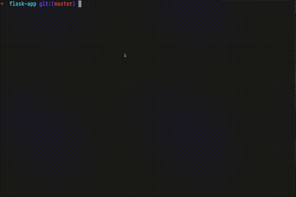

# GEPP - Developer's Helper to K8s

GEPP takes your app and Dockerize it, sets up a Kubernetes cluster and runs your app in it, configure K8s resources and produce Terraform file for Azure deployments, and more! All are happening in seconds!



## How and Why

Requirements:

- Running Docker
- main.py file
- `app` variable for WYSGI

Run:

```bash
docker run -it --rm -v /var/run/docker.sock:/var/run/docker.sock -v $PWD:/project -e PROJECT_NAME=${PWD##*/} guray/gepp:0.1-alpha3
```

GEPP provides developers to easily run their apps as containerized apps in Kubernetes. Here is what it is aiming:

- You run the tool in a directory with Python/Go/NodeJS code
- It will generate a Dockerfile depending on the framework your code uses
- It will generate YAMLs for Kubernetes deployment, pod autoscaling, service definitions (it will ask some questions like service type) + ingress
- (optional) It can generate a plan for Terraform for your cloud provider for a K8s cluster and deploying your app (in JSON, using tfcdk)
- (optional) It will insert environment variable, secretmap, configmaps to the generated YAML (interactively asks) - *WIP*
- (optional) It can get storageclasses from your cluster and define some storage and insert it to your YAML - *WIP*
- (optional) It can generate servicemonitor and podmonitor YAML files for Prometheus operator - *WIP*
- (optional) It can generate network policies for some of the network providers - *WIP*

It is mostly a repetitive task to Dockerize your project and generating YAMLs that look like ones in other projects/microservices. In addition to replaying the same steps, it may easily consume a lot of time to set up to Dockerize your app, write YAMLs for Kubernetes deployment(and define resources), configure autoscheduler, write Ingress manifests for L7 routing/LB, create Kubernetes services etc. After all of these, you should deploy a Kubernetes cluster, either locally or on a remote target; than connect to it, upload & deploy your app.

GEPP is being developed to shorten these procedures to a fully(or mostly) automatic, yet useful process. Just run `gepp` inside a directory and wait for your localhost-port pair to connect your app.

You will find Dockerfile, .dockerignore, Kubernetes YAMLS, AKS definition for deploying it with Terraform in your directory.

## Status

Currently, it is in `0.1-alpha` stage. It should work without any problems but has not tested in wild, nor all the intended features has been implemented yet. If you are encountering a problem, please open an issue.

PR's are more than welcome!

The proposal of this project consists of these steps:

- Auto detect Flask or other frameworks
- Generate Dockerfile if not exists
- Create Deployment YAML
- Create autoscaler YAML
- Create service (type optional, clusterip default)
- Create ingress definition (optional)
- Deploy to K8s (optional)
- Test with port-forward
- Generate Terraform file for K8s integration + GKE/AWS/Azure/...
- Ask secret usage, getting names from K8s (optional)
- Ask disk type, size, mountpoint (optional)
- Create local cluster with kind/minikube/k3d and deploy the app onto it
- Use skaffold/telepresence to provide a complete dev environment
- Get status, logs, metrics
- Ask metric exports
- Re-running should be possible, and it should check the YAMLs and other files to be idempotent
